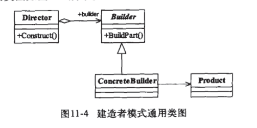
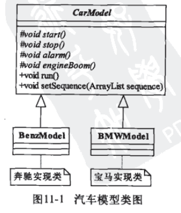
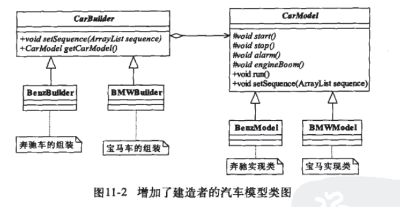
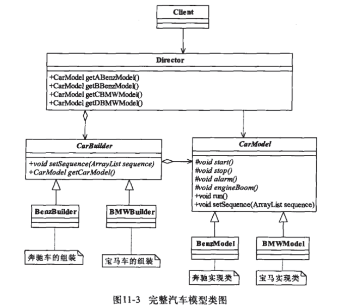

# 建造者模式(生成器模式)
> Builder Pattern  
> Separate the construction of a complex object from its representation so that the same construction process can create different representations. (将一个复杂的对象构建与它的表示分离, 使得同样的构建过程可以创建不同的表示.)


## 通用模式 



代码: [./a_common.ts](./a_common.ts)

在建造者模式中, 有如下4个角色
- `Product` 产品类
- `Builder` 抽象建造者
- `ConcreteBuilder` 具体建造者
- `Director` 导演类

执行示例代码
```
ts-node a_common.ts
```


## 书中示例

### 未使用建造者模式时
- 此示例是基于 [模板方法模式](../4_template_method)

> 新需求: 车模需要能够按照指定的顺序执行各个方法



代码:  [./b_no_builder.ts](./b_no_builder.ts)

执行示例代码
```
ts-node b_no_builder.ts
```

- 此时如果又有多个新的需求, 则只能一个个修改`Client` 类来实现, 这明显不够优雅, client 太过依赖于产品类

### 引入建造者模式后(未加入`Director`) 



代码:  [./c_no_director.ts](./c_no_director.ts)

执行示例代码
```
ts-node c_no_director.ts
```

- 此时仅仅是隔离了 `Client` 到 产品类的依赖, 每个产品类都有自己的 `Builder`创建者


### 完整的建造者模式



代码:  [./d_complete.ts](./d_complete.ts)

- 此时代码变得 简单，清晰，易懂

执行示例代码
```
ts-node d_complete.ts
```

## 建造者模式的应用
### 优点
- 封装性
  - 客户端不必知道产品内部的组成细节,
- 建造者独立, 容易扩展
- 便于控制细节风险
  - 由于具体的建造者是独立的, 因此可以对建造过程足部细化, 而不对其他的模块产生任何影响

### 使用场景
- 相同的方法, 不同的执行顺序, 产生不同的结果时, 可以采用此模式
- 多个部件或者零件, 都可以装配到一个对象中, 但是产生的运行结果又不相同时
- 产品非常复杂,或者产品类中的调用顺序不同产生不同的效能, 此时使用建造者模式非常适合
- 在对象创建过程中会使用到系统中的一些其他对象,这些对象在产品对象的创建过程中不易得到时,可以采用此模式封装该对象的创建过程 (**感觉又像代理模式???**)

### 注意事项
**建造者模式关注的是零件类型和装配工艺(如顺序), 这是它与工厂方法模式最大的不同, 虽然同为创建类模式,但是注重点不同**

## 一点理解

- 未加入建造者`Builder`之前, 客户端`Client`直接依赖于各个产品, 需要知道所有产品的各个细节,直接操作产品
- 加入`Builder`后, 客户端`Client`不需要知道产品的细节,只要依赖各个产品的建造者即可,通过抽象建造者的接口即可进行开发, 产品有变更也不需要`Client`知晓, 只要修改对应产品的`Builder`即可
- 最后加入`Director`, 起到了很好的封装作用, 避免了高层模块深入到建造者内部的实现类. (导演类也可以有多个)
- 书中示例均引入了`模板方法模式`, 也将此作为了建造者模式的扩展
- 与`工厂方法模式`不同之处的理解???

