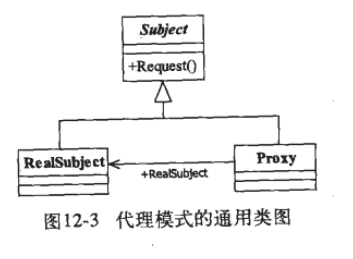
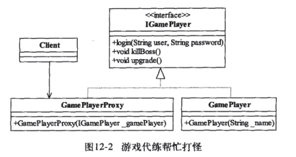

# 代理模式
> Proxy Pattern  
> Provide a surrogate or placeholder for another object to control access to it. (为其他对象提供一种代理以控制对这个对象的访问.)


代理模式, 也叫作委托模式. 许多其他的模式,如状态模式/策略模式/访问者模式本质上是在更特殊的场合使用了委托模式.(TODO: 待理解)


## 通用模式



类图说明:
- `Subject`抽象主题角色,可以是接口
- `RealSubject`具体主题角色
- `Proxy`代理主题角色

代码: [./a_common.ts](./a_common.ts)

执行示例代码
```
ts-node a_common.ts
```

## 书中示例

### 示例1



代码: [./b_game_proxy.ts](./b_game_proxy.ts)

### 普通代理 (代码略)

### 强制代理 (代码略)

### 虚拟代理 (代码略)

### 动态代理 (TODO: 待理解)


## 代理模式的应用

### 优点
- 职责清晰
  - 真实角色就是实现实际的业务逻辑,不用关心其他非本职的事务
- 高扩展性
- 智能化
  - 参考动态代理

### 应用场景
好比打官司找律师
AOP编程-> 动态代理


